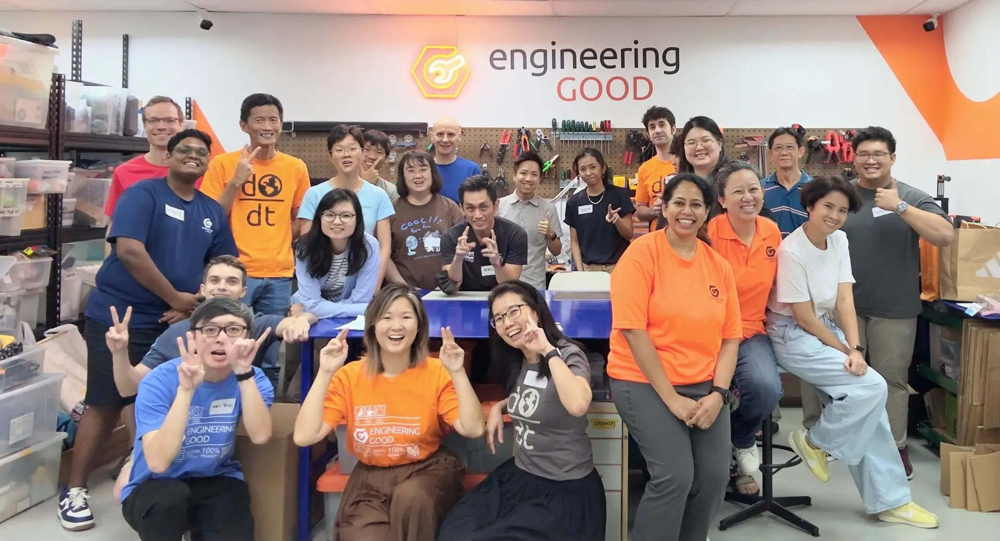

<!-- ABOUT EG START -->
# About Engineering Good(EG)

## About Us

Engineering Good Ltd is a Singapore-registered charity that brings together a community of staff and volunteers with diverse skills, including tech, engineering, and more, to serve the needs of disadvantaged communities in Singapore. Our vision is to engineer a better and more inclusive world. 

## Our Key User
1. Persons with Disabilities (PWDs) through affordable, open-source Assistive Technology
2. Disadvantaged and vulnerable individuals and families through digital inclusion initiatives

## More Details About EG

Engineering Good Ltd is a Singapore-registered charity that brings together a community of staff and volunteers with diverse skills, including technology, engineering, and more, to serve the needs of disadvantaged communities in Singapore. Our vision is to engineer a better and more inclusive world.

Through social innovation initiatives, we aim to support disadvantaged and special needs communities by enabling access to digital education and economic opportunities, and by helping them overcome daily challenges through innovative technological and engineering solutions.

Our work currently focuses on two main areas: **Assistive Technology** and **Digital Inclusion programmes**.

- **Assistive Technology (AT):** We leverage the diverse talents of our skilled volunteer community to create assistive technology products that help Persons with Disabilities (PwDs) overcome barriers to daily living – across education, recreation, and employment – enabling them to reach their full potential and live more independently. These AT solutions are realised through the following:
    - **Tech for Good Accelerator & Makers Programmes:** We train, coach, and support youths and disability sector professionals to innovate and develop assistive technology solutions that enable persons with disabilities to participate in learning, carry out daily activities, and lead more fulfilling, independent lives. The problem statements that teams work on are gathered from our Community Partners. Together with our team of skilled technical mentors, we guide youth innovators -students from institutions of higher learning and young working adults – through the process of ideating, developing, testing, and iterating AT solutions in collaboration with the Community Partners and users themselves.
    - **Inclusive Makerspace:** A space where makers and tinkerers can access tools to create open-source AT solutions.
- **Digital Inclusion**: We empower disadvantaged communities access to digital education, economic opportunities, and social connection through our 
Digital Inclusion initiatives, which include: 
    - **Laptop Refurbishment and Distribution:** Our staff and volunteers refurbish decommissioned corporate laptops and distribute them to individuals who lack access, enabling them to stay digitally connected. The disadvantaged and vulnerable communities we serve include low-income families, displaced workers, single parents, ex-offenders, residents of temporary shelters, nursing home residents, ITE students, school dropouts, migrant workers, domestic helpers, and more. This programme also promotes a “Reduce, Reuse, Recycle” sustainability culture for IT products and helps reduce e-waste. To help fund our programmes, EG supports companies in promoting IT reuse by refurbishing decommissioned laptops, which their employees can buy back as personal laptops by making a donation to EG.
    - **Digital Literacy Workshops:** We collaborate with Community Partners to conduct digital literacy programmes for different disadvantaged groups – ranging from training residents of temporary shelters to write CVs and apply for jobs online, to introducing generative AI tools to support the academic learning of students from disadvantaged families.
 
We have partnered with over 350 community partners to deliver our services in support of disadvantaged communities in Singapore and regionally since 2014.
 
Engineering Good Ltd (UEN: 201408320W) is a member of National Council of Social Services (NCSS) and registered with Commissioner of Charities in Singapore as a charity providing humanitarian aid. 

- Website: [https://www.engineeringgood.org](https://www.engineeringgood.org)
- GitHub: [Engineering Good](https://github.com/Engineering-Good)
- Instagram: [@engineeringgood](https://www.instagram.com/engineeringgood/)
- Facebook: [engineeringgood](https://www.facebook.com/engineeringgood.org/)
- LinkedIn: [engineeringgood](https://www.linkedin.com/company/engineeringgood/?originalSubdomain=sg)
- Thingiverse: Not Created
- Printables: Not Created

### Contact Us

For technical questions, to get involved, or to share your experience we encourage you to [visit our website](https://www.engineeringgood.org/), [contact us](https://www.engineeringgood.org/contact-faq/) or email us at [contactus@engineeringgood.org](mailto:contactus@engineeringgood.org).
<!-- ABOUT EG END -->
